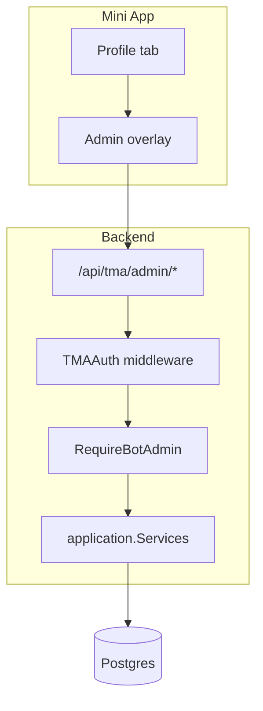

> **Superseded paths:** implemented under `frontend/src/features/*`, `shared/api`, `features/auth`. See `frontend/README.md`.

# TMA setup replacement — design

**Status:** design (pre-implementation)  
**Context:** Frontend is TMA-only (`/`). Platform REST under `/api/workspaces/*` remains for tenant bootstrap but has no UI. This spec defines how setup moves into the Mini App (admin surfaces) so platform routes can eventually shrink.

## Problem

| Setup task | Current API | TMA today |
| ---------- | ----------- | --------- |
| Google Calendar / Meet | `PATCH …/integrations` | Read-only; create fails with `meetings_not_configured` |
| Notify chat binding | `POST …/chat/link` | Not exposed |
| Team / VCS tokens | `…/members/*`, `PATCH …/vcs` | Not exposed |
| Scenarios (notify-bot) | `…/scenarios/*` | Auto tab uses client mock |
| Workspace create | `POST /api/workspaces` | Not exposed |

Alpha operators use curl + platform JWT. End users never need platform login.

## Goals

1. **Admin role in TMA** — `bot_users.role === admin` gets setup screens (extend existing Profile → Admin overlay).
2. **TMA-authenticated setup routes** — new `/api/tma/admin/*` group (same TMA JWT, admin guard), not platform JWT.
3. **Reuse application layer** — call existing `Services` methods; no duplicate business logic.
4. **Phased cutover** — platform routes stay until each TMA admin slice ships; then mark platform equivalents deprecated.

## Non-goals (this phase)

- Removing platform JWT or OTP/OAuth endpoints
- Replacing bot `/start` registration
- Full scenario visual editor in TMA (phase 2 may link to simplified list + toggle only)

## Architecture

**Admin guard:** middleware checks `c.Locals("bot_user").Role == "admin"` (same source as `BOT_ADMIN_TELEGRAM_IDS` bootstrap). Returns `403` otherwise.

## Proposed `/api/tma/admin/*` routes

Phase 1 — **meetings unblock** (highest priority):

| Method | Path | Maps to | UI |
| ------ | ---- | ------- | -- |
| `GET` | `/api/tma/admin/workspace` | First Google-configured workspace summary + integration flags | Admin home status |
| `PATCH` | `/api/tma/admin/integrations` | `PatchIntegrations` (same body as platform) | Form: Google SA JSON, subject, calendar id |
| `POST` | `/api/tma/admin/integrations/verify` | `VerifyIntegrations` | “Test connection” button |

Phase 2 — **notify-bot ops**:

| Method | Path | Maps to | UI |
| ------ | ---- | ------- | -- |
| `GET` | `/api/tma/admin/chat/status` | `ChatStatus` | Chat linked? |
| `POST` | `/api/tma/admin/chat/link` | `LinkChat` | Paste chat id / forward flow |
| `GET` | `/api/tma/admin/members` | `ListMembers` | Read-only team list |
| `POST` | `/api/tma/admin/members/sync-chat` | `SyncChatMembers` | Sync from Telegram chat |

Phase 3 — **scenarios (minimal)**:

| Method | Path | Maps to | UI |
| ------ | ---- | ------- | -- |
| `GET` | `/api/tma/admin/scenarios` | `ListScenarios` | Auto tab: real list + enable toggle |
| `PATCH` | `/api/tma/admin/scenarios/:id` | `UpdateScenario` (enabled + schedule only) | Toggle in Auto tab |
| `POST` | `/api/tma/admin/scenarios/:id/run` | `RunScenario` | Manual run (admin) |

**Workspace selection:** alpha assumes **one Google-configured workspace** (same as `ListWorkspacesWithGoogle` in create meeting). Multi-workspace picker is out of scope until product needs it.

## Frontend placement

| Surface | Change |
| ------- | ------ |
| `profile-screen.tsx` | Admin section already exists for meetings admin; add “Integrations” row → new overlay |
| `auto-screen.tsx` | Replace mock `INITIAL_SCENARIOS` with `GET /api/tma/admin/scenarios` when admin |
| New | `integrations-screen.tsx` in admin overlay — Google SA upload (paste JSON), verify |

Non-admin users: no setup UI; integrations status can show read-only banner on create failure (“ask admin to configure Google”).

## Security

- TMA JWT only; no platform JWT in Mini App
- Admin routes re-check `bot_users.role` per request (not only JWT claims)
- `PATCH integrations` accepts encrypted-at-rest SA JSON — never log body; same validation as platform handler
- Chat link tokens / chat ids — audit log at Info without secrets

## Migration / deprecation timeline

| Milestone | Platform route | Action |
| --------- | -------------- | ------ |
| Phase 1 shipped | `PATCH …/integrations` | Document deprecated for human use; keep for scripts |
| Phase 2 shipped | `…/chat/*`, `…/members/*` | Same |
| Phase 3 shipped | `…/scenarios/*` (read/toggle) | Same |
| All phases + 1 release | Platform setup routes | Optional: require `X-Setup-Token` or remove from public deploy |

`POST /api/me/link-telegram` — **removed (410)** in current release.

## Acceptance criteria (phase 1)

1. Admin can paste Google SA config in TMA and run verify without curl.
2. Non-admin gets `403` on `/api/tma/admin/*`.
3. After configure, `POST /api/tma/meetings` succeeds for any registered user.
4. `docs/API.md` lists `/api/tma/admin/*` when implemented.

## Open questions

- **SA JSON in Mini App:** paste textarea vs upload file — start with paste (KISS).
- **OAuth platform login:** keep for operators who prefer web curl; no UI planned.
- **Multi-workspace:** defer until second tenant.

## References

- [API.md](../../API.md) — current route split
- [ARCHITECTURE.md](../../ARCHITECTURE.md) — dual auth stacks
- [MEETINGS.md](../../MEETINGS.md) — meetings + integrations dependency
- Existing admin overlay: `frontend/src/features/tma/screens/profile-screen.tsx`
